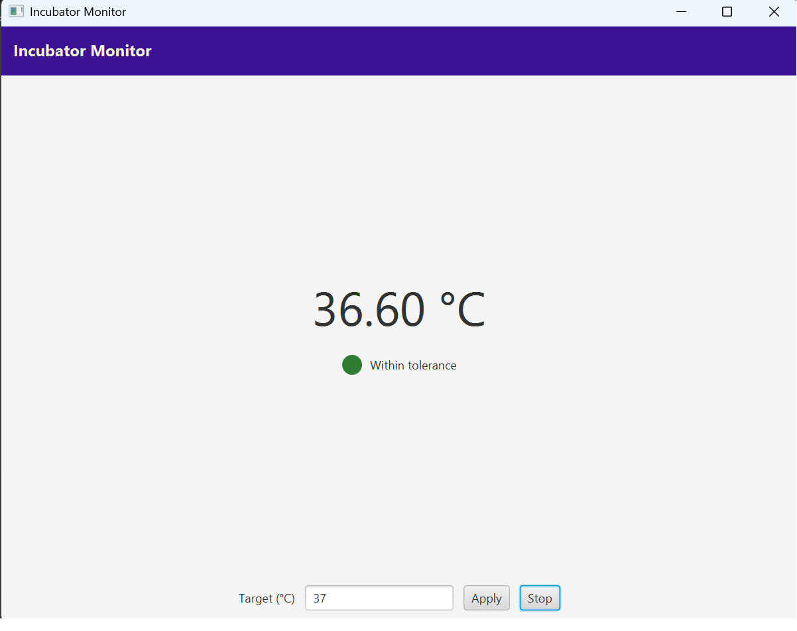
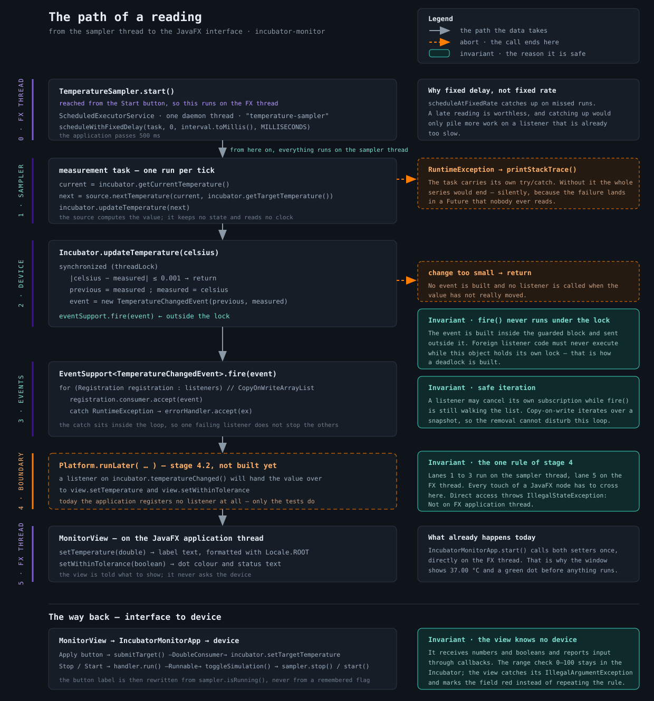
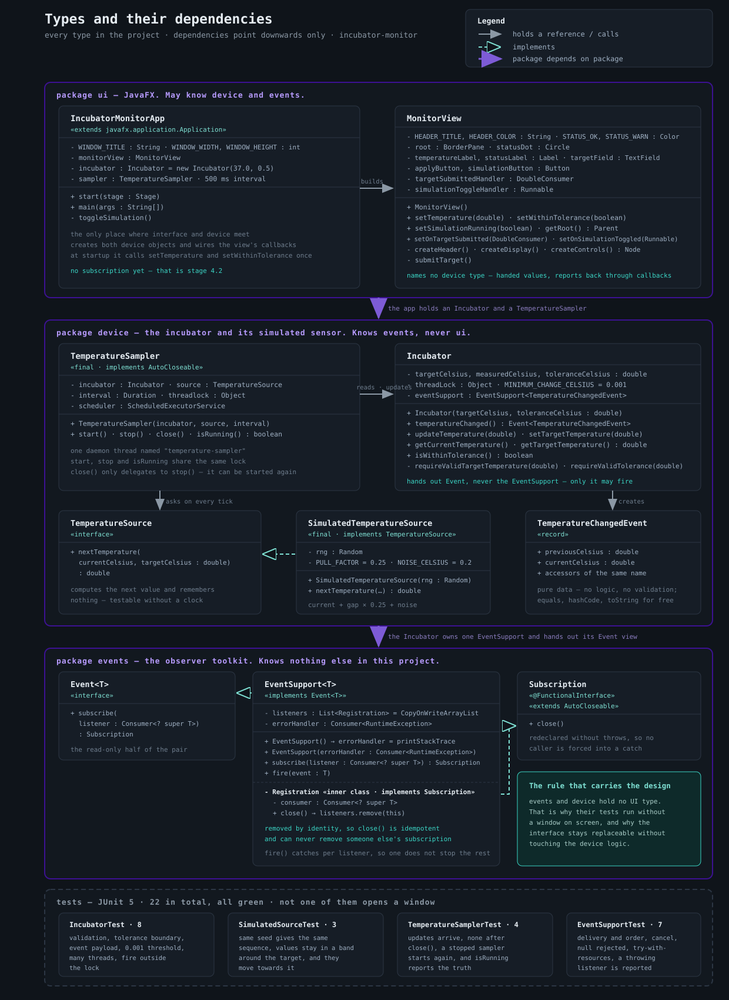
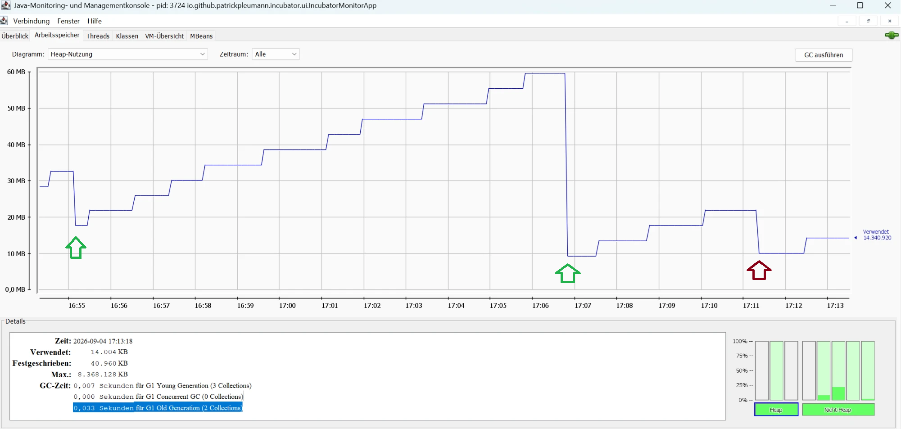
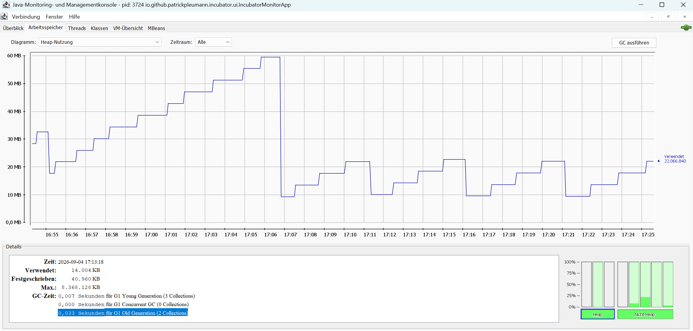

# Inkubator-Monitor

[English](README.md) · **Deutsch**

> **Stand: abgeschlossen — alle fünf Etappen fertig** — 04.09.2026

Ein simuliertes Laborgerät in Java: ein CO₂-Inkubator, der Zellkulturen auf einer Zieltemperatur
hält, seine Messwerte aus einem eigenen Thread meldet und von einer JavaFX-Oberfläche überwacht
wird.



---

## Worum es geht

Es gibt **keine echte Hardware**. Der Sensor ist simuliert — aber die Nebenläufigkeit ist echt:
Der Messwert entsteht auf einem anderen Thread als dem, der die Oberfläche zeichnet. Genau an
dieser Grenze liegt der interessante Teil.

Das Projekt ist der praktische Teil eines Umstiegs von C# nach Java. Der Anspruch ist bewusst
nicht „möglichst viele Features", sondern **nachvollziehbar zu sein**: Die Entscheidungen, die
etwas tragen, sind aufgeschrieben — mitsamt denen, die bewusst offen geblieben sind. Ein kleines
Projekt, das durchdacht ist, ist hier mehr wert als ein großes, das nur läuft.

Vier Themen kommen dabei in ihrer natürlichen Reihenfolge zusammen: das Observer-Muster (Java hat
kein `event`-Schlüsselwort — wer Ereignisse will, baut sie), Nebenläufigkeit, die Anbindung an
eine UI mit eigenem Thread, und Testbarkeit.

---

## Starten

Voraussetzung ist ein **JDK 21** — die Gradle-Toolchain ist auf Java 21 LTS festgelegt. JavaFX holt
Gradle selbst; von Hand ist nichts zu installieren.

```
gradlew test    # alle Tests
gradlew run     # Anwendung starten
```

Unter Windows heißt der Wrapper `gradlew.bat`, unter Linux und macOS `./gradlew`.

`gradlew run` öffnet das oben abgebildete Fenster. Nach einem Druck auf **Start** aktualisiert sich
der Messwert zweimal pro Sekunde; die Statusanzeige wechselt auf Bernstein, sobald der Wert das
Toleranzband um den Sollwert verlässt, und zurück auf Grün, sobald er es wieder erreicht.

---

## Aufbau

Drei Pakete, Abhängigkeiten **nur nach unten**:

```
ui        JavaFX. Kennt device und events.
          ↑ Thread-Grenze
device    Inkubator + Sensor-Simulation. Kennt events, kennt die UI nicht.
events    Observer-Baukasten. Kennt nichts.
```

`events` und `device` haben keine UI-Abhängigkeit. Deshalb laufen ihre Tests ohne laufendes
Fenster, und deshalb wäre die Oberfläche austauschbar, ohne die Gerätelogik anzufassen.

---

## Diagramme

Ein Klick öffnet das jeweilige Diagramm in voller Größe. Beschriftet sind sie auf Englisch,
wie der Code.

| [**The path of a reading**](docs/flow-reading-path.svg) | [**Types and their dependencies**](docs/class-diagram.svg) |
|:--|:--|
| [](docs/flow-reading-path.svg) | [](docs/class-diagram.svg) |
| Was bei jedem Takt passiert — wo der Wert unter einer Sperre liegt, wo ein Aufruf abbricht und wo die Thread-Grenze verläuft. | Alle Typen der drei Pakete mit Feldern und Methoden, und wer wen kennt. |

---

## Die fünf Etappen

| # | Etappe | Ergebnis | Stand |
|---|---|---|---|
| 1 | **Gerüst** | Gradle-Projekt, das startet und testet | ✅ fertig |
| 2 | **Observer-Baukasten** | Ereignisse zustellen und abbestellen, getestet | ✅ fertig |
| 3 | **Gerät und Nebenläufigkeit** | Ein Inkubator, der aus einem eigenen Thread meldet | ✅ fertig |
| 4 | **Oberfläche** | JavaFX-Fenster, das Messwerte anzeigt | ✅ fertig |
| 5 | **Abrunden** | README, frischer Klon, Grenzen benannt | ✅ fertig |

**Etappe 1 — Gerüst.** Gradle mit Kotlin-DSL, Java-21-Toolchain, JavaFX und JUnit. Die drei Pakete
und ein leeres Fenster, das sich sauber schließt.

**Etappe 2 — Observer-Baukasten.** `Event`, `EventSupport` und `Subscription`. Der Code stammt aus
einem Vorläuferprojekt und wurde **unverändert übernommen**, dann wurden Tests dagegen geschrieben,
dann wurde repariert — in dieser Reihenfolge. Zwei echte Fehler kamen dabei ans Licht: Das
Abmelden konnte fremde Abos beenden, und Fehler aus Listenern verschwanden ohne Stacktrace. Beide
wurden erst als roter Test sichtbar gemacht und dann behoben.

**Etappe 3 — Gerät und Nebenläufigkeit.** Der `Incubator` mit Zieltemperatur und Toleranz, dazu
eine Sensor-Simulation, die in festem Takt neue Messwerte erzeugt. Hier geht es um Atomarität
statt bloßer Sichtbarkeit, um Sperren, die niemals fremden Code umschließen, und um einen
Zeitgeber, der sich sauber beenden lässt.

**Etappe 4 — Oberfläche.** Ein JavaFX-Fenster mit Messwertanzeige, Sollwert-Eingabe und
Start/Stopp. Jeder Zugriff aus dem Sensor-Thread läuft über `Platform.runLater(…)` — die Brücke
zwischen den Threads ist der eigentliche Inhalt dieser Etappe.

Die schriftliche Abnahmeliste wurde von Hand durchgegangen und in allen neun Punkten bestanden —
siehe [Abnahme](#abnahme) weiter unten.

**Etappe 5 — Abrunden.** README, ein frischer Klon, der ohne Nacharbeit baut und startet, und eine
ehrliche Liste dessen, was bewusst offen blieb. Der Klon entstand am 04.09.2026 mit einer *frischen*
Gradle-Ablage, JavaFX und JUnit wurden also neu geladen statt aus einem Zwischenspeicher genommen:
Tests grün, Fenster startet, Schließen sauber. Nachzutragen war nichts.

Jede Etappe endet in einem vorzeigbaren Zustand. Was da ist, läuft; die Tests sind grün.

---

## Abnahme

Es gibt hier **keine automatisierten UI-Tests** — sie bräuchten eigenes Werkzeug und einen
laufenden Fenster-Server, unverhältnismäßig für ein Fenster dieser Größe. An ihrer Stelle steht
eine schriftliche Abnahmeliste aus neun Punkten, am 04.09.2026 von Hand durchgegangen und
vollständig bestanden. Der letzte davon war der einzige, der es wert war, aufgehoben zu werden:
*zehn Minuten laufen lassen, keine wachsende Speicherlast*.

[](docs/acceptance-heap.png)

*Zwanzig Minuten. **Grün: von Hand erzwungenes Aufräumen. Rot: eines, das die JVM von selbst
ausgelöst hat.***

Die ersten zehn Minuten steigt die Kurve nur — von 17 auf 59 MB, kein Sägezahn weit und breit. Das
sieht nach einem Leck aus und ist keins: Der Heap darf hier bis 8 GB wachsen, also hatte der
Aufräumer keinen Anlass und wurde kaum tätig. Das erzwungene Aufräumen lässt ihn dann auf 9 MB
fallen und den festgeschriebenen Speicher von 110 auf 41 MB schrumpfen. Erst danach räumt die JVM
im dritten Tal von selbst auf — vermutlich, weil sich der Jungbereich eines kleineren Heaps eher
füllt. Dieser letzte Teil ist eine Deutung der Zahlen, nicht hier gemessen.

[](docs/acceptance-heap-30min.png)

*Derselbe Durchlauf nach einer halben Stunde. Alles ab 17:06 macht die JVM von allein.*

Sich selbst überlassen, pendelt sie sich ein: hoch auf rund 22 MB, runter auf rund 10 MB, etwa alle
fünf Minuten. Drei Zyklen, drei Tiefpunkte, alle auf derselben Höhe. **Ein Leck würde den Boden mit
jedem Zyklus ein Stück anheben** — dieser rührt sich nicht.

Gelernt wurde dabei weniger über den Code als über das Messwerkzeug: Bei großzügigem Heap sagt eine
steigende Kurve nichts, vergleichbar sind nur Tiefpunkte. Die vollständige Messung samt der Zähler
des Aufräumers steht im Review-Protokoll von [`ENTWICKLUNGSPLAN.md`](ENTWICKLUNGSPLAN.md).

---

## Eine Entwurfsentscheidung: Rechenmodell statt Sensor

Die Messwerte kommen aus einem austauschbaren Typ hinter einem Interface. Dessen Methode lautet

```java
double nextTemperature(double currentCelsius, double targetCelsius);
```

Sie **rechnet** den nächsten Wert aus, statt ihn abzulesen, und merkt sich dabei nichts — beides
zusammen macht sie ohne Zeitgeber und ohne Thread prüfbar. Die Naht ist damit ein
**Rechenmodell**, kein Sensor: Austauschbar sind verschiedene Verläufe (ruhig, träge, gestört),
nicht echte Hardware.

Das ist bewusst so. Ein Interface, hinter das echte Hardware passt, müsste vier Dinge mehr tragen:
eine Methode ohne Argumente (ein Sensor liest ab, statt zu rechnen), eine Antwort auf Lesefehler
(geprüfte Ausnahme oder `OptionalDouble`), eine Lebensdauer (`AutoCloseable`, weil eine Verbindung
geöffnet und geschlossen werden muss) — und womöglich die umgekehrte Richtung, weil echte Sensoren
sich oft von selbst melden, statt abgefragt zu werden. Nichts davon hätte hier einen Gegenwert:
Rechnen schlägt nicht fehl, und hinter dem Interface steckt eine Zufallsformel.

Ausschlaggebend war, dass die Entscheidung **umkehrbar bleibt**. Das Interface hat genau einen
Benutzer — den Typ, der den Takt hält. Ein späterer Wechsel auf echte Sensorik fasst eine Klasse
an und stellt eine zweite daneben. Abstraktionen werden nicht dadurch teuer, dass man sie zu spät
einführt, sondern dadurch, dass man sie an zehn Stellen wieder herausoperieren muss.

---

## Technik

Java 21 LTS · Gradle (Kotlin-DSL) · JavaFX 21 · JUnit

---

## Bewusste Entscheidungen und offene Punkte

### Warum der Code so aussieht, wie er aussieht

**Ein privates Schloss statt `synchronized(this)`.** Mit `this` als Schloss könnte jeder Aufrufer
von außen mitsperren und das Gerät blockieren, ohne dass in der Klasse etwas darauf hinweist. Ein
privates Feld lässt sich nur von innen sperren.

**`fire()` läuft außerhalb des Sperrbereichs.** Das Ereignis entsteht im geschützten Block und wird
außerhalb zugestellt. Listener-Code ist fremder Code, und fremder Code darf niemals laufen, während
dieses Objekt seine eigene Sperre hält — so baut man eine Verklemmung. Der Preis steht unter den
offenen Punkten: Ereignisse können in anderer Reihenfolge ankommen, als die Änderungen geschahen.

**Der Sampler merkt sich keinen eigenen Zustand.** Bei jedem Takt holt er den aktuellen Wert aus
dem Inkubator, statt eine eigene Kopie zu führen. Zwei Stellen, die dieselbe Wahrheit behaupten,
laufen auseinander, sobald jemand anders `updateTemperature` aufruft.

**`scheduleWithFixedDelay`, nicht `scheduleAtFixedRate`.** Feste Termine werden nachgeholt. Ein
verspäteter Messwert ist wertlos, und das Nachholen würde einen ohnehin zu langsamen Listener nur
weiter zustauen.

**Daemon-Threads für den Sampler.** Ein `ScheduledExecutorService` erzeugt von sich aus keine. Ohne
eine `ThreadFactory` mit `setDaemon(true)` läuft der Prozess nach dem Schließen des Fensters weiter.

**Werte aus dem Gerät werden vor `Platform.runLater(…)` gelesen, nie darin.** Der Block läuft
später auf dem FX-Thread. Eine Frage, die darin steht, wird mit dem Zustand dieses späteren
Moments beantwortet — die Zahl käme dann aus einer Messung und die Statusfarbe aus der nächsten.

**`MonitorView` kennt den `Incubator` nicht.** Sie bekommt Zahlen und Wahrheitswerte und meldet
Eingaben über `DoubleConsumer` und `Runnable` zurück. Es geht dabei **nicht** um Lebensdauern — der
Inkubator lebte so oder so gleich lang —, sondern darum, wer wen kennen darf: Löscht man das ganze
Paket `ui`, kompilieren `device` und `events` weiter und ihre Tests laufen weiter. Genau deshalb
brauchen die Tests auch kein Fenster auf dem Bildschirm.

**Aufgeräumt wird in `Application.stop()`, nicht in `stage.setOnCloseRequest(…)`.** Die Laufzeit
ruft `stop()` bei jedem **regulären** Ende auf — beim Schließen des letzten Fensters ebenso wie bei
`Platform.exit()`; ein hartes `System.exit()` umgeht es, dann wird aber ohnehin nichts mehr
aufgeräumt. Ein Schließen-Ereignis feuert dagegen nur beim Zuklicken dieses einen Fensters und kann
von einem anderen Handler abgefangen werden.

**`CopyOnWriteArrayList` für die Listener.** Ein Listener darf sein eigenes Abo beenden, während
`fire()` noch durch die Liste läuft. Copy-on-write iteriert über eine Momentaufnahme, das Entfernen
kann die Schleife also nicht stören. Kopiert wird nur beim **Ändern** der Liste — also beim An- und
Abmelden, nicht beim Feuern: Hier sind das zwei Kopien im ganzen Programmlauf, während das Gerät
zweimal pro Sekunde meldet, ohne die Liste anzufassen. Die falsche Wahl wäre sie erst dort, wo sich
Listener ständig an- und abmelden; die Länge der Liste multipliziert dann nur noch den Preis der
einzelnen Kopie.

**Rechenmodell statt Sensor hinter der Naht** — die längste dieser Entscheidungen hat
[einen eigenen Abschnitt](#eine-entwurfsentscheidung-rechenmodell-statt-sensor) weiter oben.

### Werkzeugwahl

**Java 21 LTS, nicht die neueste Fassung.** 21 ist die Version, die in Firmen tatsächlich läuft.
Das kostet die kurze `void main()` neuerer Ausgaben — dafür wird die klassische
`public static void main(String[] args)` geübt.

**Die Oberfläche entsteht in Java-Code, nicht in FXML.** Ein Werkzeug weniger, das schiefgehen
kann. FXML bringt bei diesem Umfang keinen Vorteil.

**Keine Fremdbibliotheken.** Nur JDK, JavaFX und JUnit. Alles andere würde den Eigenanteil
verwischen.

**Keine automatisierten UI-Tests** — was stattdessen da ist, steht unter [Abnahme](#abnahme).

**Bewusst außen vor:** Netzwerk, Datenbank, Persistenz, Multi-Modul-Aufbau. Nichts davon würde
etwas zeigen, was die vier Kernthemen nicht schon zeigen.

### Was bei mehr Zeit anders wäre

- **Reentranz beim Feuern.** Löst ein Listener während `fire()` selbst eine Änderung aus,
  verschachteln sich die Ereignisse. Eine Warteschlange würde es lösen; bis dahin ist es
  dokumentiertes Verhalten statt ungewollter Zufall.
- **Reihenfolge bei gleichzeitigen Änderungen.** Weil `fire()` außerhalb der Sperre läuft, können
  Ereignisse in anderer Reihenfolge ankommen, als die Änderungen geschahen. Die Alternative — fremder
  Listener-Code unter der eigenen Sperre — ist der schlechtere Tausch.
- **Kein Rückstau-Schutz.** Ein langsamer Listener bremst den Sensor-Thread. Bei echter Hardware
  bräuchte es eine Warteschlange dazwischen.
- **Zwei Antworten auf Listener-Fehler im selben Paket.** `EventSupport` nimmt einen Fehler-Handler
  entgegen, `TemperatureSampler` schreibt den Stacktrace selbst. Einheitlichkeit kostete einen
  Konstruktorparameter, den bisher kein Aufrufer braucht.
- **Ein Listener, der den Sampler schließt, blockiert eine Sekunde.** Er wartet auf ein Schloss, das
  der Thread hält, der seinerseits auf die Rückkehr dieses Listeners wartet. Es löst sich nach dem
  Zeitlimit von selbst, ist aber eine echte Sekunde Stillstand.
- **Fehlerbehandlung in der Oberfläche ist minimal.** Der Kern ist abgesichert, die Oberfläche
  nicht — eine bewusste Gewichtung, kein Versehen.

---

## Mehr Details

- **[`CLAUDE.md`](CLAUDE.md)** — warum das Projekt so geschnitten ist, welche Entscheidungen
  getroffen wurden und was bewusst offen bleibt
- **[`ENTWICKLUNGSPLAN.md`](ENTWICKLUNGSPLAN.md)** — was gebaut wird, in welcher Reihenfolge,
  mit Anforderungen, Testlisten und den Protokollen über Abweichungen
